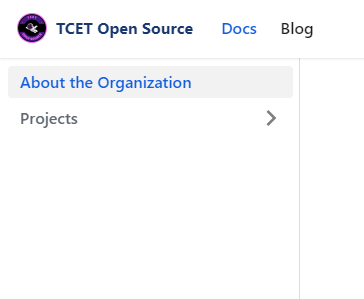
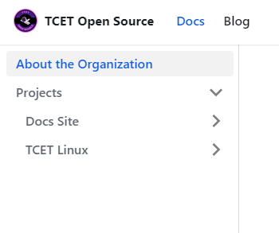

### Adding links in our sidebars:

To add links to our categories in the sidebar for our project documentation, we followed these steps:

1. Opening the `sidebars.js` file where our sidebar configuration is defined.

2. Next, we headed towards the category where we wanted to add the `link`.

3. Under the `category` label, we added a `link` property with an object containing the following keys:

    - `type`: This should be set to 'doc' if you want to link to another documentation page. If you want to link to an external URL, set this to 'link'.
    - `title`: This should be the title that is to be displayed on the page.
    - `description`: A short descrption about the project page.
    - `keywords`: This will be helpful in identifying key words and provide better results on Search Function.

    <br />

    ```jsx title="sidebars.js" {8-14} showLineNumbers
    const sidebars = 
    {
        docs: 
        [
            {
                type: 'category',
                label: 'Projects',
                link:
                {
                    type: 'generated-index',
                    title: 'Project Docs',
                    description: 'Official Documentation of all TCET Open Source projects',
                    keywords: ['documentation, open-source'],
                },
            },
        ],
        // Other sidebar properties
    }
    module.exports = sidebars;
    ```

    We updated the keys values within the object according to our requirements.

4. After completing the above steps, we then moved further with defining the default page for our sidebar and also to set the nature of our sidebar in terms of **Collapsibility**.

    ```jsx title="sidebars.js" {5,16} showLineNumbers
    const sidebars = 
    {
        docs: 
        [
            'about-tcetopensource',
            {
                type: 'category',
                label: 'Projects',
                link:
                {
                    type: 'generated-index',
                    title: 'Project Docs',
                    description: 'Official Documentation of all TCET Open Source projects',
                    keywords: ['documentation, open-source'],
                },
                collapsed: false,
            },
        ],
        // Other sidebar properties
    }
    module.exports = sidebars;
    ```

    - We inserted the default page link at the start of our 'docs' array because we wanted that whenever someone clicks on the **`Docs`** item in our [**Navbar**](../navbar/adding-items.md), they should see the [**About Us**](../about-docs.md) page of [**TCET Open Source**](https://opensource.tcetmumbai.in/).

    - We updated the value of `collapsed` property to `false` as we dont wanted our main category to hide everytime someone redirects to the `Docs` section.

    | collapsed: true | collapsed: false |
    | :--: | :--: |
    |  |  |
    
    You can clearly see the difference between the two properties when their values are updated respectively.

<br />

_Now that we briefed you about how we added links in the sidebars of our [**TCET Open Source**](https://opensource.tcetmumbai.in/), the next step is to add some [**items to our categories**](adding-items) in the sidebar. This will allow us to organize our documentation and make it easier for users to navigate through the different sections of our website._