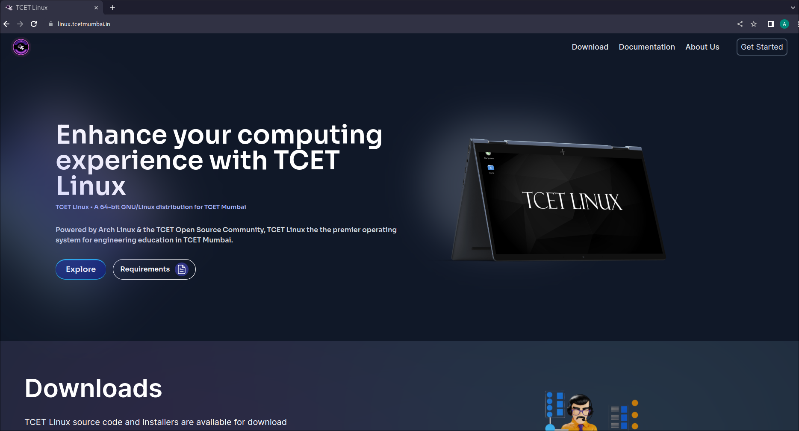
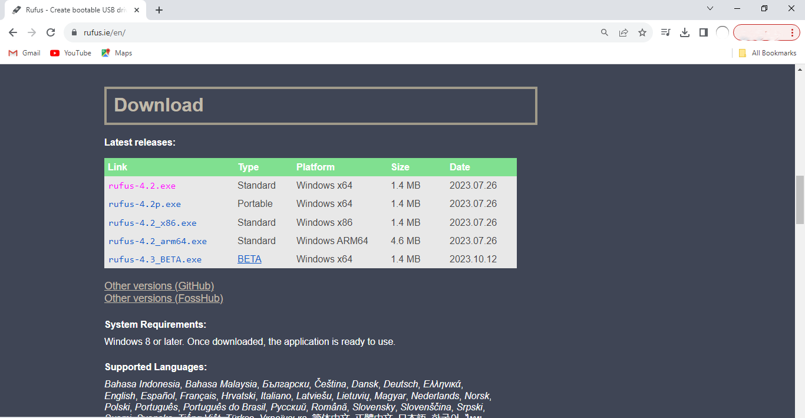
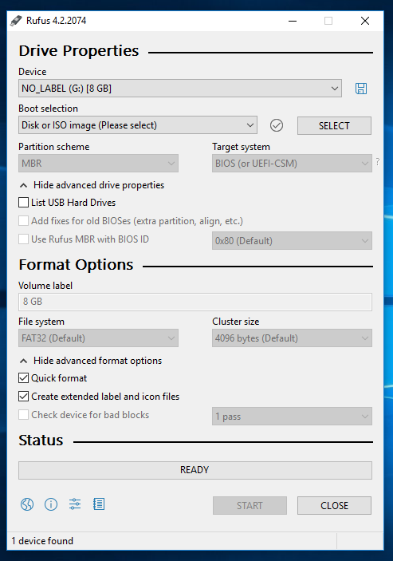
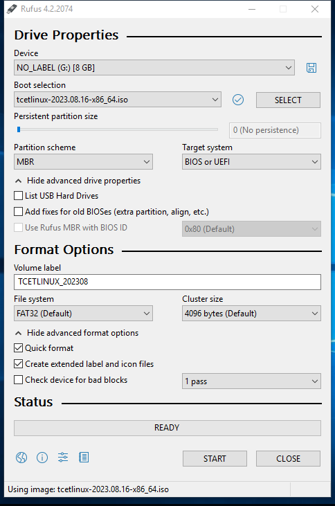
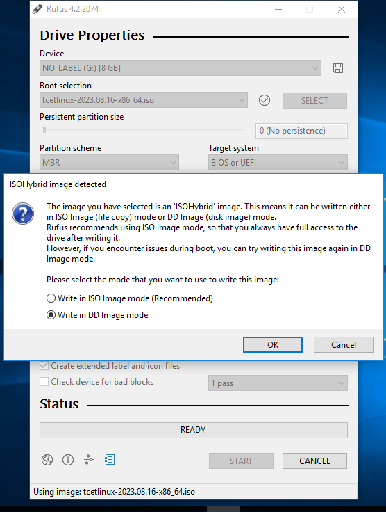

Welcome to the TCET Linux Installation guide! This comprehensive walkthrough will assist you in installing [TCET Linux](https://github.com/tcet-opensource/tcet-linux/releases/) using a bootable pendrive. Follow this guide on the [TCET Linux Website](https://linux.tcetmumbai.in/) for a seamless installation experience.
You can use tools like Rufus, Balena Etcher, or Win32 Disk Imager to create a bootable USB drive. Follow the instructions provided by your chosen tool to flash the TCET Linux ISO to the USB drive.

Here's an example with Rufus

### Step 1: Download TCET Linux

Download the latest version from our [official website](https://linux.tcetmumbai.in/#download).



### Step 2: Prepare the Bootable USB Stick with Rufus

1. Download and install [Rufus](https://rufus.ie/) on your Windows PC.

   

2. Open Rufus, granting necessary permissions.

   

3. Select your USB device under "Device" and choose the TCET Linux ISO by clicking on `SELECT`.

   

4. Configure the settings: 
   - Ensure the partition scheme is MBR for compatibility with both BIOS and UEFI systems.
   - Click `START`.

   

5. Choose DD mode in the pop-up menu and click `OK`. Be aware that all data on the USB will be erased.

:::note
Ensure you select the correct drive to avoid data loss.
:::

### Step 3: Boot from USB

1. Insert the USB into your computer and restart.
2. Access the BIOS menu (usually Delete, Escape, F9, or F10) before the Windows OS loads.
3. Under "Boot Options," select "TCET Linux" and press Enter.
4. If the screen freezes, wait for about 5 minutes; you should reach the login page.

### Linux Users

For Linux users, employ the 'dd' command in the terminal:

```bash
sudo dd bs=4M if=/path/to/tcet-linux.iso of=/dev/sdX status=progress
```

After completing the bootable pendrive installation, your USB is ready. Proceed to the next section to learn how to install TCET Linux using a virtual machine.

Explore the potential of [TCET Linux](https://linux.tcetmumbai.in/) and enjoy a seamless open-source experience!
_After successfully implementing the **[bootable pendrive installation](bootable-pendrive)** of **[TCET Linux](https://linux.tcetmumbai.in/)**, we were ready with a bootable drive. Next, we will be seeing how we can install it using virtual machine ._
